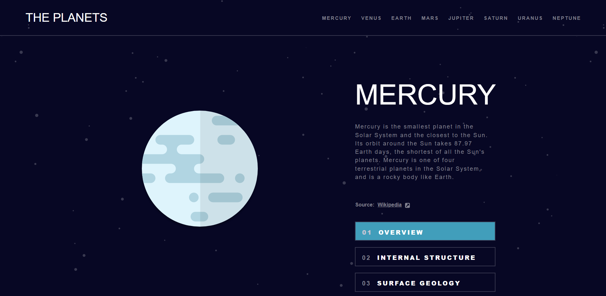
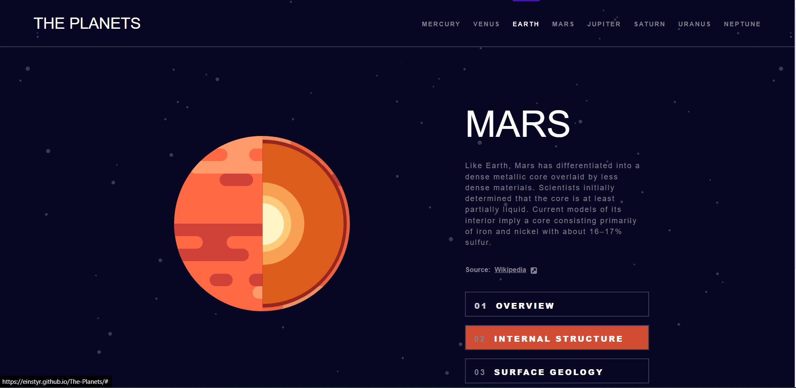
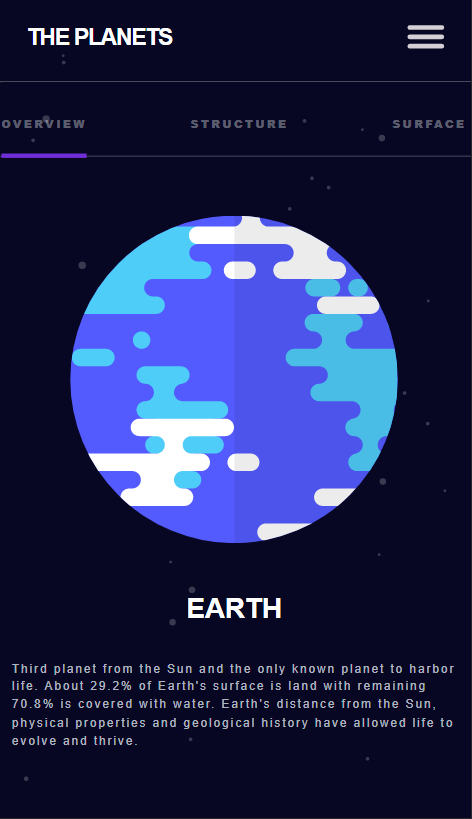
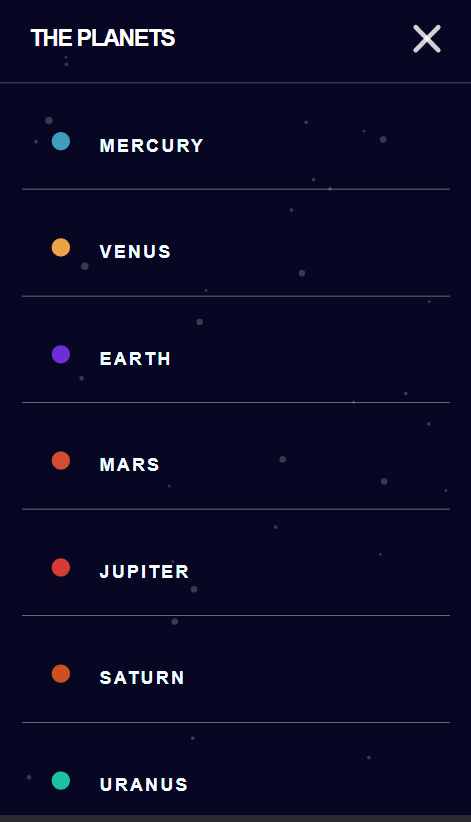

# The-Planets

<h3> Screenshots </h3>
- Desktop main 

- Desktop active state  

- Mobile main

- Mobile menu

## Table of contents

- [Overview](#overview)
  - [Screenshot](#screenshot)
  - [Links](#links)
- [My process](#my-process)
  - [Built with](#built-with)
  - [What I learned](#what-i-learned)
  - [Continued development](#continued-development)
  - [Useful resources](#useful-resources)
- [Author](#author)
- [Acknowledgments](#acknowledgments)

### Links

- Live Site URL: https://einstyr.github.io/The-Planets/

## My process

- This project was pretty chaotic. I liked idea and design and started right away. First big doubt was to make single page or 8 page for each planet. Since, I thought
one HTML page would be cooler, I went on that road and it was hard. Hardest thing to do was three button, which will show different text when it's clicked.
I found the solution but I know it's not best one. It took me nearly week to built this project and my confidence was going down, so I decided to finish it ASAP.

### Built with

- Semantic HTML5 markup
- CSS custom properties
- Flexbox
- CSS Grid
- Vanilla JS

### What I learned

- During this project, I learned a LOT of things: 

    - Not take Intermediate challange when you are not ready. 
    - To think a lot how your project should be built.
    - How important is Mobile First style.
    - How to manipulate DOM.
    - How not to manipulate DOM.
    - Chatgpt is new Rubber Duck.
    
 ### Continued development
 
 - After this project, I started to search courses, which will focus only Frontend and dives in detailes. I realized
 that I lack knowladge in JS and how Html, Css and JS interact. 
 
 ### Useful resources

- I don't have specific author but I was googling a LOT. Basically for JS problems.

## Acknowledgments

- Kudos to all Google authors and Jochem fomr Kevin Powell Discord community.

